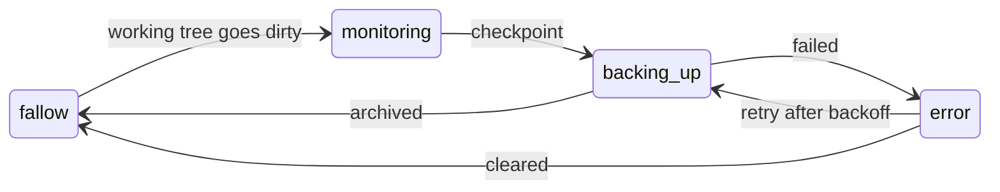

# 😋 delightd

*A small daemon that keeps your work safe before you remember to — and tells you,
for certain, when it is.*

You work across a dozen projects at once. A few have uncommitted changes; one or
two haven't been pushed in a while. You're not thinking about any of it — no
reason to — until you reformat a machine or a long job runs the box out of
memory, and the one thing you want is to know, for certain, that nothing was lost.

That's delightd. It runs in the background, watches every project you've told it
about, and **checkpoints work the moment it notices the work exists.** At any
instant it can answer the one question worth being sure of before something
irreversible: *is everything saved?*

## The trick: it reads the same signal you do

delightd doesn't poll your disk on a timer or wire into the filesystem. It
watches the thing that already means "there's unsaved work here": **your git
status.** A working tree with uncommitted changes is, by definition, work worth
keeping — so a dirty tree is the cue to make a checkpoint. delightd calls this the
*git oracle*, and it's the whole idea in a line: the signal that tells *you* a
project has unsaved work is the signal that tells delightd to back it up.



A checkpoint is a rotating `.tgz` archive, and delightd keeps one rule it will
never break: **it backs your work up; it never deletes your work.** It rotates
only its own archives — it will not touch a model, weight, or cache directory,
even to make room. Those are excluded by name, never pruned.

## "Is everything saved?" — answered live, never cached

Ask delightd `GET /git` and it sweeps every project's working tree *right now*,
in parallel, and reports what's uncommitted, unpushed, or adrift:

```json
{ "name": "paling", "git": { "branch": "main", "dirty": false, "unpushed": 0, "has_upstream": true } }
```

It computes that live, per request — never from a cache — on purpose. The answer
gates real decisions (you don't want a stale "all clear" greenlighting a machine
wipe over uncommitted work), so a slightly slower honest answer beats a fast lie.

## One source of truth, and no backup plan — deliberately

delightd has no peer and no quorum, and the tools that rely on it **fail closed**
when it's down: they return an error rather than guess. That's a choice, not an
oversight. The alternative — every consumer reimplementing "is this project
clean?" with its own almost-right logic — is how you end up with several
confident, disagreeing answers. delightd takes the opposite bet: build *one*
component that has to come up in any condition, and let everything else simply
trust it. It's built to run on one machine — yours — and it's happy to be
deployed to a cluster, but it only ever *manages* your machine; running anyone
else's assets was never the job.

## "Control plane" — and the ones I chose not to use

Go already has control-plane libraries, and they solve a different problem.
Envoy's [go-control-plane] and gRPC's xDS stream desired configuration out to a
fleet of data planes and own a snapshot cache; Kubernetes' [controller-runtime]
reconciles declared state against the world in a loop. delightd does neither — it
distributes no configuration and runs no reconcile loop. It answers, per request,
what is *true* about a project right now, and emits an event for the one action it
owns. Those are superb libraries from legendary engineers, and the scale they're built
for is real — it's just nowhere near this one. delightd is built the right way for
*what it is*, not dressed up as something bigger for the look of it. If the fleet
ever grows into that scale, that's a new component beside delightd — not a
retrofit of it.

[go-control-plane]: https://github.com/envoyproxy/go-control-plane
[controller-runtime]: https://github.com/kubernetes-sigs/controller-runtime

## A clean idea of what a "project" is

delightd's atomic unit is the **project** — never a "repo," "service," or
"deployment." A project is a named piece of work; its git tree is something
delightd *observes*, not something it owns; "service" is a *role* a project can
play, not the thing itself. Keeping that vocabulary honest is what lets the API
stay consistent instead of slowly accreting synonyms.

## What else it does

Beyond checkpoints and git truth, delightd discovers the local LLM endpoints
running on the box and publishes routes to them; aggregates each project's
declared agent tools into one interface (an MCP endpoint and a generated
`delight` CLI); and emits a best-effort event after every checkpoint — telemetry
that degrades silently and never blocks a backup.

## Dig in

| If you want… | Read |
|---|---|
| the components, the git oracle, the taxonomy | [docs/architecture.md](docs/architecture.md) |
| every control-port route and JSON shape | [docs/api.md](docs/api.md) |
| the fail-closed / deploy-before-use contract | [docs/availability.md](docs/availability.md) |
| the checkpoint pipeline + the never-touch-weights rule | [docs/backups.md](docs/backups.md) |
| the Kafka event contract | [docs/events.md](docs/events.md) |
| the agent interface and `delight` CLI | [docs/agent-interface.md](docs/agent-interface.md) |
| config schema, env, kube deploy, build | [docs/operations.md](docs/operations.md) |
| where delightd is headed | [docs/fleet-and-delightd.md](docs/fleet-and-delightd.md) |

## Run it

```bash
task build      # regenerate proto bindings, build bin/delightd
task test       # go test ./...
./bin/delightd  # reads delight.yaml from $HOME/etc/delightd or the cwd
```

The control port is `:8088`.
